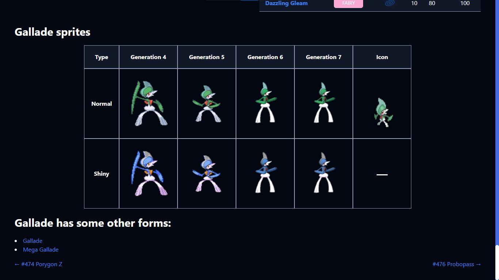
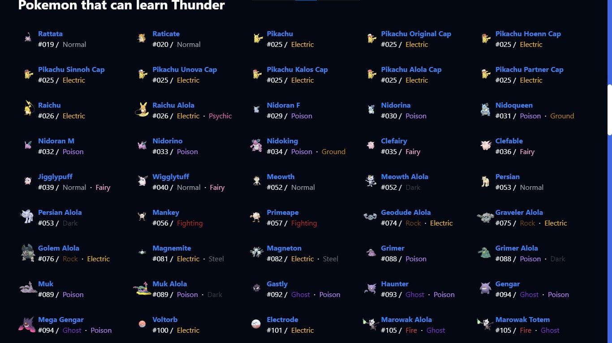
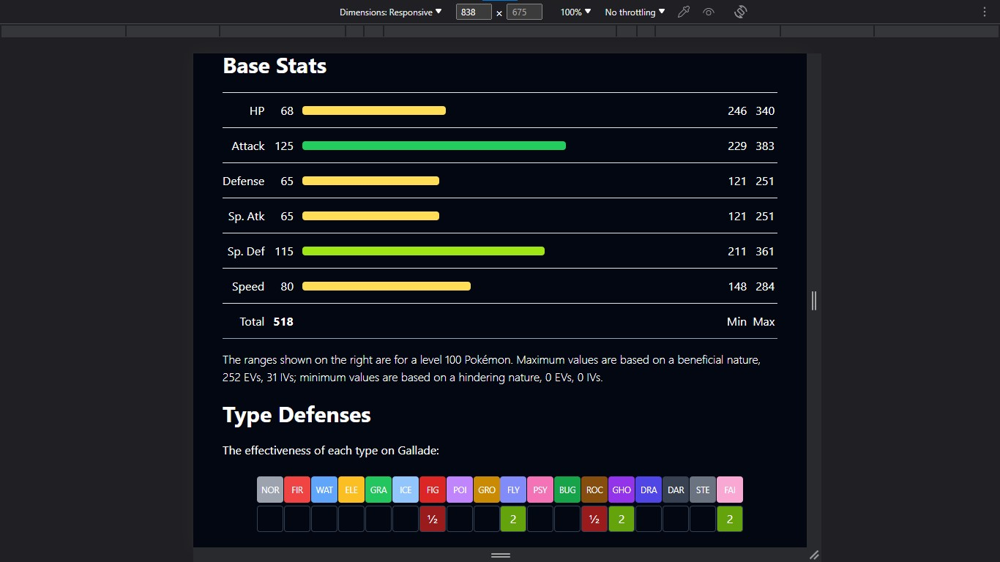

# Pokemon App

A React app that uses the [PokemonAPI](https://pokeapi.co/) to display various information about Pokemon in the games. This is a basic clone of the website [pokemondb.net](https://pokemondb.net/).

## Technologies and Libraries used:

- React
- TailwindCSS
- React Router
- Framer Motion
- React Query
- Axios
- React Loading Skeleton

## Features:

### 1. A very 'professional' landing page :-)

### 2. List of Pokemon by Generation (up to generation 7) and different forms

### 3. Details of individual Pokemon

### 4. List of all moves (up to generation 7)

### 5. Detail of individual moves

### 6. Type list and type chart

### 7. Detail of the types

### 8. List of all abilities

### 9. Details of Individual Abilities

### 10. Region-wise Location List

### 11. Reponsive Design

